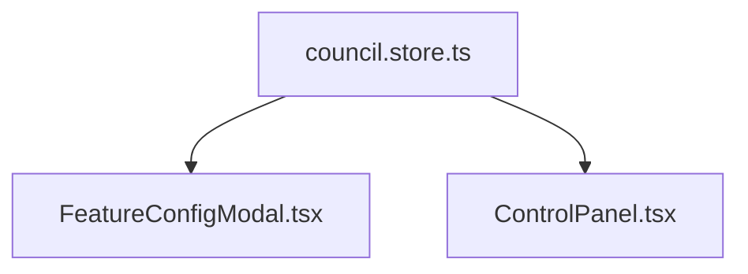

# System Graph Visualization Plan
*Target: Council-Git-V9-CODEX*
*Path: `/docs/SYSTEM_GRAPH_VISUALIZATION.md`*

## Overview
A comprehensive structural map of the entire Council codebase has been exported to `/docs/SYSTEM_GRAPH.json`. The graph consists of **271 node entities** (Files partitioned by Component, Service, Store, Config, Utility) linked by **1063 import edges**.

This document outlines how to visualize this JSON structure for architectural deep-dives.

---

## 1. D3.js Browser Dashboard (Local Execution)
The most flexible option to interact with the 271 nodes is to render a Force-Directed Graph.

**How to implement:**
1. Create a minimal html file (`graph-viewer.html`) containing:
```html
<script src="https://d3js.org/d3.v7.min.js"></script>
```
2. Ingest `SYSTEM_GRAPH.json` and map:
   - `nodes` array to `d3.forceSimulation(nodes)`
   - `edges` array to `d3.forceLink(edges).id(d => d.id)`
3. Color code nodes based on the `type` property generated in our AST scraper:
   - `component`: 🟦 Blue
   - `service`: 🟩 Green
   - `store`: 🟨 Yellow 
   - `utility`: 🟧 Orange

---

## 2. Mermaid Diagram Generators (Markdown Rendering)
For embedding sections of the graph directly into GitHub PRs or Markdown wikis, use a script to chunk the JSON into Mermaid sub-graphs.

**How to implement:**
Because 1063 edges will crash Mermaid JS instantly, build a contextual query script:
```typescript
// Proposed query shape: npx tsx scripts/visualize-meramid.ts "src/stores/council.store.ts" --depth=2
```
This would read the JSON, find all edges 2 degrees from `council.store.ts`, and stream out:


---

## 3. Obsidian / Logseq Vault Migration
If you maintain a local knowledge base (like an Obsidian Vault) for software architecture:
1. Iterate over `systems_graph.nodes`
2. Generate one `.md` file per node.
3. In the frontmatter of each file, write out the `classes:` and `interfaces:`.
4. In the body, write `[[TargetNode_ID]]` referencing every edge targeting that node.
Obsidian's native graph view will perfectly cluster the 1063 relationships automatically.

## Output Target Review
The generated `/docs/SYSTEM_GRAPH.json` is statically structured to be consumed natively by any of the 3 presentation methodologies above.
